# DeepGuard System Architecture

> 💡 **Beginner Note:** This document explains how all the pieces of DeepGuard fit together. If you're brand new, you might want to start with [How It Works (Simple)](HOW_IT_WORKS_SIMPLE.md) first!

## 🎯 Overview

DeepGuard is like a restaurant with three main parts:
1. **Frontend (Dining Room)** - What you see and interact with
2. **Backend (Kitchen)** - Where the processing happens
3. **AI Model (Chef)** - The expert that analyzes the images

All three work together to detect deepfakes quickly and accurately!

---

## 📊 How Everything Fits Together

Here's a visual diagram showing how data flows through the system:

```mermaid
graph TD
    User[👤 You] -->|Upload Image| Frontend[🌐 Web Interface]
    Frontend -->|Send to Server| Backend[🖥️ Flask Backend]
    Backend -->|Prepare Image| Pre[📐 Image Preprocessing]
    Pre -->|Convert to Tensor| Model[🤖 DeepGuard AI Model]
    
    subgraph "🧠 DeepGuard AI Model (The Four Detectives)"
        RGB[Detective #1: Visual Inspector]
        Freq[Detective #2: Frequency Analyst]
        Patch[Detective #3: Detail Expert]
        ViT[Detective #4: Big Picture Thinker]
        
        RGB & Freq & Patch & ViT -->|Combine Evidence| Fusion[🤝 Discussion & Vote]
        Fusion -->|Make Decision| Classifier[⚖️ Final Verdict]
    end
    
    Classifier -->|Calculate Probability| Result[📊 Results]
    Result -->|Send Back| Frontend
    Frontend -->|Display| User
```



**In simple terms:**
1. You upload an image through the website
2. The website sends it to the backend server
3. The server prepares the image for analysis
4. The AI model (with its 4 branches) analyzes it
5. All branches vote on whether it's real or fake
6. Results are sent back to you with a confidence score and heatmap!

---

## 🏗️ The Three Main Components

### 1. Frontend (What You See) 🌐

**What it is:** The visual interface you interact with - basically the website you see in your browser.

**Technology Used:**
- HTML5 (structure of the page)
- CSS3 (makes it look pretty)
- JavaScript (makes it interactive)

**Why these technologies?** They're standard web technologies that work in any browser, no special software needed!

**Key Features:**

#### Drag & Drop Upload Zone
- Just drag an image from your computer and drop it on the page
- No complicated forms or buttons - super simple!

#### Real-Time Feedback
- Shows a loading animation while analyzing
- Lets you know something is happening

#### Heatmap Visualization
- Shows you a colorful overlay highlighting suspicious areas
- warm colors (red/orange) = suspicious
- Cool colors (blue/green) = looks normal

#### History Dashboard
- See your past scans
- Review previous results
- Track patterns over time

**Files:**
- `index.html` - Main upload page
- `analysis.html` - Results display page
- `history.html` - Past scans page
- `style.css` - All the visual styling
- `script.js` - Interactive functionality
- `loader.js` - Loading animations
- `three_bg.js` - 3D background effects (optional eye candy)

---

### 2. Backend (The Processing Engine) 🖥️

**What it is:** The "behind-the-scenes" server that receives images, runs the AI, and sends back results.

**Technology Used:**
- **Python** - The programming language
- **Flask** - A tool for creating web servers
- **SQLite** - A tiny database for storing history

**Why these technologies?**
- Python is excellent for AI/ML work
- Flask is simple but powerful
- SQLite needs no setup - it's just a file!

**What the Backend Does:**

#### 1. API Endpoints (Ways to Talk to the Backend)
Think of these like different phone numbers you can call for different services:
- `/api/predict` - "Analyze this image please"
- `/api/history` - "Show me my past scans"
- `/api/health` - "Are you working?"

**Learn more:** See [Backend API Documentation](BACKEND_API.md)

#### 2. Image Preprocessing
**What:** Prepares your image for the AI model

**Steps:**
1. Resize to 256×256 pixels (AI models need consistent sizes)
2. Normalize colors (adjust brightness/contrast to standard values)
3. Convert to a "tensor" (the format the AI understands)

**Why needed?** The AI was trained on 256×256 images, so it expects that size. It's like how you can't put a square peg in a round hole!

#### 3. Model Inference (Running the AI)
- Loads the trained AI model into memory
- Feeds it the preprocessed image
- Gets back a prediction

#### 4. Explanation Generation (The Heatmap)
- Uses a technique called Grad-CAM
- Works backwards through the AI to see what it "looked at"
- Creates a visual heatmap showing suspicious areas

---

### 3. Deep Learning Core (The AI Brain) 🧠

**What it is:** The actual AI that can tell real from fake.

**Technology:**
- **PyTorch** - A popular AI framework
- **Torchvision** - Tools for working with images
- **Safetensors** - Fast and safe way to save models

**Architecture:** The 4-Branch System

Think of it like having four different experts each examining the image:

#### Branch #1: Spatial (RGB) Analysis
**Technology:** EfficientNetV2-Small

**What it does:** Looks at the image the normal way - colors, shapes, edges

**Looking for:** Visual artifacts, inconsistent lighting, weird textures

**Analogy:** Like a regular art critic examining a painting

---

#### Branch #2: Frequency Analysis
**Technology:** FFT (Fast Fourier Transform) + Custom CNN

**What it does:** Converts the image into a frequency spectrum and looks for hidden patterns

**Looking for:** Grid artifacts that GANs leave behind, unnatural repeating patterns

**Analogy:** Like examining a painting with UV light to see things invisible to the naked eye

---

#### Branch #3: Patch Analysis  
**Technology:** Shared Encoder analyzing local patches

**What it does:** Chops the image into small squares and examines each closely

**Looking for:** Local inconsistencies, areas that are "too perfect," mismatched details

**Analogy:** Like using a magnifying glass on every inch of a painting

---

#### Branch #4: Global Semantic (ViT) Analysis
**Technology:** Swin Transformer V2 Tiny

**What it does:** Looks at the whole image to check if it makes logical sense

**Looking for:** Impossible physics, illogical relationships between objects, weird perspectives

**Analogy:** Like stepping back and asking "wait, does this scene even make sense?"

---

### How the Branches Work Together

1. All four branches analyze the image **simultaneously** (at the same time)
2. Each creates a "feature vector" (basically a list of what they found)
3. All four feature vectors are **combined** (concatenated)
4. The combined information goes through a **classification head** (the final decision maker)
5. Out comes a single number between 0 and 1:
   - **Close to 0** = Probably REAL
   - **Close to 1** = Probably FAKE

**Think of it like a jury:** Each member (branch) examines different evidence, they deliberate together, and vote on the final verdict!

---

## 🔄 The Complete Journey (Data Flow)

Let's follow an image through the entire system:

### Step 1: You Select an Image
- You choose `family_photo.jpg` from your computer
- The frontend reads the file

### Step 2: Upload to Backend
- Image is sent via HTTP POST to `/api/predict`
- The backend receives it and validates it (checks it's actually an image)

### Step 3: Preprocessing
- Backend resizes it to 256×256 pixels
- Normalizes the colors
- Converts it to a PyTorch tensor

### Step 4: AI Analysis
The model processes the image:
- **RGB Branch** looks at colors and shapes
- **Frequency Branch** analyzes hidden patterns
- **Patch Branch** examines local details
- **ViT Branch** checks overall logic

Each branch creates its report (feature vector)

### Step 5: Combining Evidence
- All four reports are merged together
- The classification head analyzes the combined evidence
- A "fake probability" score is calculated (e.g., 0.985 = 98.5% sure it's fake)

### Step 6: Creating the Heatmap
- The backend traces back through the RGB branch
- Identifies which pixels influenced the decision most
- Creates a heatmap image showing these areas
- Encodes it as Base64 (a way to send images as text)

### Step 7: Sending Results Back
The API returns JSON data like:
```json
{
  "prediction": "FAKE",
  "confidence": 98.5,
  "fake_probability": 0.985,
  "real_probability": 0.015,
  "heatmap": "base64_encoded_image_data..."
}
```

### Step 8: Display to User
- Frontend receives the results
- Shows "FAKE" with 98.5% confidence
- Displays the heatmap overlay
- Adds a record to your history

**Total time:** Usually 1-10 seconds depending on your hardware!

---

## 💾 Data Storage

### History Database (SQLite)
**What's stored:**
- Filename of uploaded image
- Prediction (REAL or FAKE)
- Confidence score
- Timestamp

**What's NOT stored:**
- The actual image (privacy!)
- Personal information

**Where:** `backend/history.db` (a simple file)

---

## 🔒 Security & Privacy

### Running Locally
- Everything happens on YOUR computer
- Images never leave your machine
- No data sent to external servers

### If Deployed Online
- Images are processed on your server
- No third-party APIs involved
- You control all the data

---

## ⚡ Performance Considerations

### Device Selection
The backend automatically chooses the best available hardware:

1. **NVIDIA GPU (CUDA)** - Fastest! (1-3 seconds per image)
2. **Apple Silicon (MPS)** - Fast on M1/M2/M3/M4 Macs (2-5 seconds)
3. **CPU** - Slowest but always works (5-15 seconds)

### Model Size
- The `best_model.safetensors` file is ~200-500MB
- Contains millions of learned parameters
- Loads into RAM when the server starts
- Stays in memory for fast repeated predictions

---

## 🔧 Customization Points

Want to modify DeepGuard? Here are the main configuration files:

- **`model/src/config.py`** - AI model settings (batch size, learning rate, etc.)
- **`backend/app.py`** - Server settings (port, CORS, etc.)
- **`frontend/script.js`** - API URLs, UI behavior
- **`frontend/style.css`** - Visual appearance

---

## 📚 Want to Learn More?

**For specific components:**
- **Frontend details:** [Frontend Guide](FRONTEND.md)
- **API endpoints:** [Backend API Documentation](BACKEND_API.md)
- **Advanced customization:** [Advanced Usage](ADVANCED_USAGE.md)

**For simpler explanations:**
- **How it works:** [How It Works (Simple)](HOW_IT_WORKS_SIMPLE.md)
- **Technical terms:** [Glossary](GLOSSARY.md)
- **Common questions:** [FAQ](FAQ.md)

---

**Bottom Line:** DeepGuard combines a user-friendly web interface with a powerful multi-branch AI system to detect deepfakes accurately and quickly. All the parts work together seamlessly to give you reliable results!
