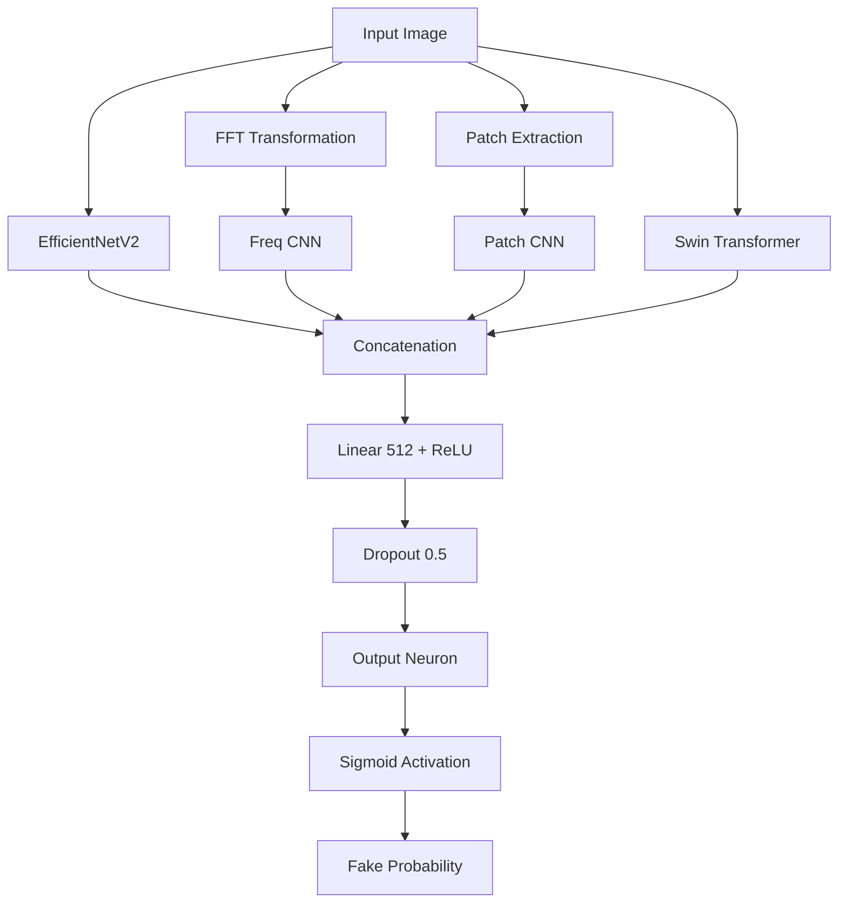

# 🏗️ Model Architecture

The **DeepGuard** architecture is a **Multi-Branch Network** designed to capture different "fingerprints" of generative AI. Unlike standard classifiers that look only at visible pixels, DeepGuard analyzes the image across four distinct domains.

## 1. The 4-Branch System

### 🟢 Branch 1: Spatial Analysis (RGB)
*   **Model**: `EfficientNetV2-Small` (Pretrained on ImageNet)
*   **Purpose**: Detects visible high-level artifacts (warped backgrounds, asymmetry, strange lighting).
*   **Why**: EfficientNetV2 is the current state-of-the-art for efficient image classification, providing a strong baseline for visible errors.
*   **Mechanism**: The network extracts features from the raw RGB image. We utilize the feature map just before the final classification layer.

### 🔵 Branch 2: Frequency Analysis (FFT)
*   **Model**: Custom 3-Layer CNN
*   **Input**: 2D Fast Fourier Transform (Log-Magnitude Spectrum)
*   **Purpose**: Detects "Grid Artifacts" and Checkerboard patterns common in GANs and Diffusion models.
*   **Why**: Generative models rely on upsampling (transposed convolutions) which leave distinct, invisible periodic patterns in the frequency domain. Real cameras do not have these patterns.

### 🟠 Branch 3: Patch Analysis (Texture)
*   **Model**: Shared Weights CNN
*   **Process**:
    1.  Image is sliced into 16 non-overlapping `64x64` patches.
    2.  Each patch is fed into the same small CNN interpreter.
    3.  **Max Pooling** is applied across all patch features.
*   **Purpose**: Identifies local inconsistencies. If *any* part of the image looks fake (e.g., just the eyes or mouth), the "Max Pool" logic ensures the whole image is flagged.

### 🟣 Branch 4: Semantic Consistency (ViT)
*   **Model**: `Swin Transformer V2-Tiny` (Pretrained)
*   **Purpose**: Long-range dependency modeling.
*   **Why**: CNNs look at local pixels. Transformers look at the relationship between far-away pixels. This helps detect semantic errors like "a person with 3 hands" or "shadow pointing the wrong way."

---

## 2. Feature Fusion & Classification

The features from all 4 branches are concatenated into a single vector layer.

## 3. Explainability (Grad-CAM)

The model includes a built-in Grad-CAM (Gradient-weighted Class Activation Mapping) mechanism on the **RGB Branch**.
*   **Target Layer**: Last convolutional block of EfficientNet.
*   **Output**: A heatmap highlighting pixels that contributed most to the decision.
*   **Use Case**: Helps users trust the model by seeing *what* it is looking at.
